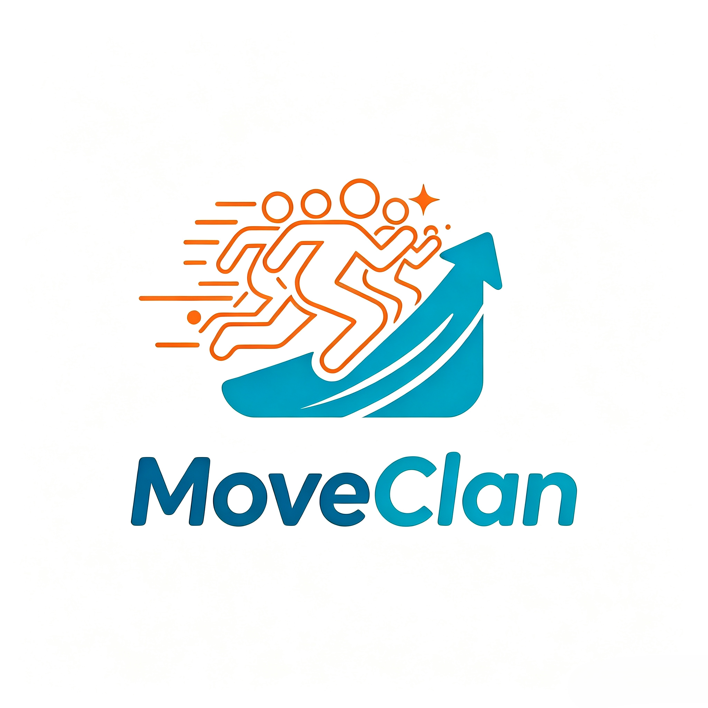

# MoveClan（跃动圈）运动打卡小程序

<p align="center">
  
</p>

面向微信群的轻量级运动打卡工具：群成员记录每日运动数据，查看周/月排行榜相互激励。
技术栈：微信小程序原生框架 + 微信云开发（CloudBase）。

## 小程序 Logo

- 原图存放于 `miniprogram/images/logo.png`（2043×2043 方形）。
- **底部 TabBar 图标**：已由 `logo.png` 生成到 `miniprogram/images/`（81×81，普通灰度版 + 选中彩色版，共 10 个），`app.json` 已引用。
- **微信端「小程序头像/Logo」**：需在 [微信公众平台](https://mp.weixin.qq.com/)「设置 → 基本设置 → 小程序头像」上传（建议上传 144×144 的方形图，可裁剪自 `logo.png`），代码无法自动设置。

## 目录结构

```
MoveClan/
├── project.config.json         # 开发者工具项目配置（miniprogramRoot / cloudfunctionRoot）
├── miniprogram/                # 小程序前端
│   ├── app.js / app.json / app.wxss
│   ├── config.js               # ★ 云环境 ID 等配置（部署时必改）
│   ├── settings.js             # 功能类配置项（如动态分页条数）
│   ├── images/                  # TabBar 图标 + 小程序 Logo 原图（logo.png）
│   ├── utils/                  # 常量、日期工具、云函数调用封装、Mock 层
│   ├── pages/
│   │   ├── index/              # 首页（打卡入口 + 本周概览 + 最近记录）
│   │   ├── feed/               # 动态页（群动态 + 点赞 + 评论）
│   │   ├── ranking/            # 排行页（周/月 × 次数/卡路里/时长）
│   │   ├── groups/             # 群组页（创建/加入/列表）
│   │   ├── group-detail/       # 群详情（成员/邀请码/退出）
│   │   ├── checkin-edit/       # 打卡表单（新建/编辑共用）
│   │   └── profile/            # 我的（统计/日历/资料/订阅开关）
│   └── components/
│       ├── calendar/           # 打卡日历组件
│       ├── confetti/           # 成就彩带弹窗组件
│       └── weight-chart/       # 体重变化曲线组件（Canvas）
├── cloudfunctions/             # ★ 20 个云函数
├── database/                   # 5 个集合的初始化 JSON（权限/索引/示例）
└── docs/superpowers/specs/     # 设计文档
```

## 一、准备工作

1. 在 [微信公众平台](https://mp.weixin.qq.com/) 注册小程序，获取 AppID。
2. 下载安装 [微信开发者工具](https://developers.weixin.qq.com/miniprogram/dev/devtools/download.html)。
3. 用开发者工具「导入项目」，选择本目录 `MoveClan`，填入你的 AppID（暂未注册可先用测试号）。

> **本地 Mock 预览（无需云环境/注册账号）**：`miniprogram/config.js` 中 `MOCK_ENABLED: true` 时，应用使用本地假数据（`miniprogram/utils/mock.js`），可在开发者工具「游客模式」下离线预览全部页面（登录/群/打卡/排行/统计/日历均有假数据）。联调真实云环境时请将 `MOCK_ENABLED` 置为 `false` 并填写 `CLOUD_ENV_ID`。

## 二、开通云开发并配置环境

1. 工具栏点击「云开发」→ 开通云开发 → 创建环境（如 `moveclan-prod`），记下**环境 ID**。
2. 修改 `miniprogram/config.js`：

```js
module.exports = {
  CLOUD_ENV_ID: '你的环境ID',   // ★ 必改
  SUBSCRIBE_TEMPLATE_ID: '',     // 订阅消息模板 ID（预留，可暂留空）
  CONTENT_CHECK_ENABLED: true    // 内容安全审核开关
}
```

3. 在「云开发控制台 → 设置」确认当前环境与你填写的环境 ID 一致。

## 三、创建数据库集合与索引

云开发控制台 → 数据库 → 创建以下 5 个集合（详见 `database/` 下对应 JSON 文件）：

| 集合 | 权限设置 | 索引（索引管理里创建） |
|---|---|---|
| `users` | 仅创建者可读写 | `openid` 唯一索引 |
| `groups` | 仅管理端可读写（防邀请码直读） | `inviteCode` 唯一索引；`status` |
| `group_members` | 仅创建者可读写 | `(groupId, openid)` 唯一索引；`openid` |
| `checkins` | 仅创建者可读写 | `(groupId, checkDate)`；`(openid, checkDate)`；`(groupId, openid, checkDate)`；`(groupId, createTime)` |
| `weight_records` | 仅管理端可读写 | `(openid, createTime)` |

> `database/*.init.json` 内的 `sampleDocs` 仅供参考字段结构，可直接跳过不导入。

## 四、部署云函数

在开发者工具的资源管理器中，展开 `cloudfunctions`，对每个云函数右键 →「上传并部署：云端安装依赖」。

共 20 个：`login`、`createGroup`、`updateGroup`、`joinGroup`、`getMyGroups`、`getGroupInfo`、`getGroupMembers`、`removeMember`、`dismissGroup`、`leaveGroup`、`submitCheckin`、`updateCheckin`、`deleteCheckin`、`getGroupRanking`、`getMyStats`、`getFeed`、`likeCheckin`、`commentCheckin`、`deleteComment`、`getWeightRecords`。

> **内容安全审核（可选）**：`submitCheckin` / `updateCheckin` 通过 `cloud.openapi.security.msgSecCheck` / `imgSecCheck` 调用微信内容安全接口。
> 若你的小程序类目不支持或接口报错，云函数会自动降级放行并记录日志，不影响打卡功能。
> 若在部署时提示需要权限，可在云开发控制台「设置 → 开放接口」中确认相关能力已开通。

> **重要：`_openid` 字段**。云开发中「仅创建者可读写」权限依赖记录里的 `_openid` 字段，但该字段只有**小程序端**写入时会自动生成；**云函数写入的数据不会自动带 `_openid`**。
> 本项目所有云函数写入时已手动携带 `_openid`（即创建者 openid），因此客户端能正常读取自己的群成员关系与打卡记录。
> 若你的环境里存在本修复之前产生的旧数据（`group_members` / `checkins` 无 `_openid` 字段），需要回填才能被客户端读取：在云开发控制台打开对应集合，对无 `_openid` 的记录批量编辑，把 `_openid` 设为该记录的 `openid` 字段值即可（测试阶段直接清空重建更省事）。

## 五、真机预览与调试

1. 开发者工具点「编译」即可在模拟器预览；点「预览」生成二维码用真机调试。
2. 首次使用流程：登录（自动建档）→ 创建群组获取邀请码 → 复制邀请码给好友 → 好友输入邀请码加入 → 双方打卡 → 查看排行榜。
3. 排行榜当前用户行会高亮显示，底部固定显示「我的排名」。

## 六、提交审核前必读

1. **用户隐私保护指引**：微信公众平台「设置 → 服务内容声明 → 用户隐私保护指引」中需声明收集：
   - 用户信息（昵称、头像，用于展示与排行榜）
   - 运动数据（打卡记录，用于统计排行）
   - 身高体重（用于卡路里估算、BMI 计算与趋势展示）
   - 相册/相机图片（打卡截图，用于留存记录）
   - 评论内容（动态评论，用于互动展示）
   并说明用途与开发者联系方式。
2. **类目**：若涉及社群/社区内容，按需选择合适的服务类目（运动打卡属「生活服务-运动」相关类目）。
3. 确认 `config.js` 中环境 ID 已替换，未使用测试数据。
4. 首次发布建议先用「体验版」在微信群内小范围试用。

## 七、数据与性能说明

- 排行榜与统计采用**实时聚合计算**，编辑/删除打卡后立即反映，无脏数据。
- **排行榜缓存**：`getGroupRanking` 内置 60 秒内存缓存（`cache` 包），同一分钟内的多次查看只查一次数据库，大幅降低数据库压力；缓存随云函数实例生命周期自动失效，数据新鲜度最高延迟 60 秒。
  - 同样带 60 秒缓存：`getMyStats`（个人统计）、`getGroupMembers`（成员列表）。
  - 所有接口支持 `refresh: true` 参数绕过缓存，前端下拉刷新时会传该参数强制更新。
  - 注意：这几个云函数需「云端安装依赖」（已声明 `cache` 依赖）。
- **图片加载提速**：排行/成员列表头像由云函数通过 `cloud.getTempFileURL` 换取临时链接并追加 `imageMogr2/thumbnail/200x` 缩略参数，缩略图体积与加载时间可减少 90% 左右；首页/我的页头像直接对 `cloud://` fileID 追加同样参数。
- **前端分页**：首页「最近打卡」每页加载 5 条，上滑触底自动加载下一页（`skip`/`limit`），不一次性拉取全部历史。
- **避免二次下载**：项目未使用 `wx.getImageInfo`，图片一律用 `<image>` 的 `src` 直接显示。
- 若后续访问量进一步增大，可增加 `rankSnapshot` 定时云函数：
  - 新建定时触发器（每天 00:05 触发）云函数，将各群周/月排行结果写入快照集合；
  - `getGroupRanking` 改为优先读快照、下拉刷新时实时重算回写，兼顾速度与新鲜度。

## 八、订阅消息（预留接口）

- 页面已提供「订阅消息设置开关」，调用 `wx.requestSubscribeMessage` 请求授权。
- 需在微信公众平台申请「一次性订阅消息」模板，将模板 ID 填入 `miniprogram/config.js` 的 `SUBSCRIBE_TEMPLATE_ID`。
- 推送逻辑（如每日打卡提醒）需额外开发定时云函数，本期未包含。

## 九、常见问题

| 问题 | 处理 |
|---|---|
| 提示「云函数调用失败：FunctionName not found」 | 云函数未部署或未选对环境，检查 `config.js` 环境 ID |
| 查询提示「权限校验失败」 | 集合权限未按第三节设置 |
| 无法调用内容安全接口 | 类目限制导致，已做降级放行，不影响主流程 |
| 头像昵称为默认 | 在「我的 → 编辑资料」中使用微信头像昵称填写能力修改 |
